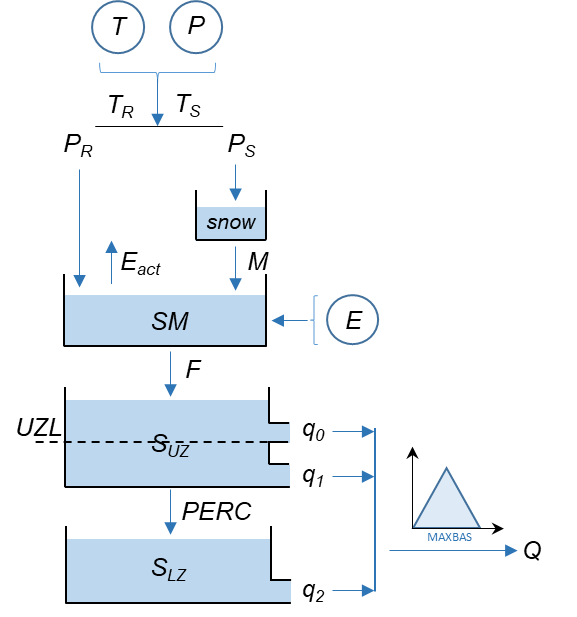

## HBV hydrological model
### Introduction

The HBV model is a semi-distributed model, which means
that a catchment can be separated into different elevation
and vegetation zones as well as into different subcatchments. 
The model consists of different routines and simulates
catchment discharge, usually on a daily time step,
based on time series of precipitation and air temperature
as well as estimates of monthly long-term potential evaporation
rates. In the snow routine snow accumulation and
snowmelt are computed by a degree-day method. In the soil
routine groundwater recharge and actual evaporation are simulated
as functions of actual water storage. In the response
(or groundwater) routine, runoff is computed as a function
of water storage. Finally, in the routing routine a triangular
weighting function is used to simulate the routing of the
runoff to the catchment outlet.





### Snow routine

The snow routine of the model controls snow accumulation and melt and works separately for each elevation and vegetation zone. Precipitation is considered to be either snow or rain, depending on whether the temperature is above or below a threshold temperature ($P_{TT}$). The precipitation accumulates as snow when the air temperature drops below a threshold value ($P_{TT}$). 

To account for undercatch of snow precipitation and winter evaporation, which is little known, snow accumulation is adjusted by a free parameter, $P_{SFCF}$, the snowfall correction factor.

$$
P_{rain} = P, T_{air} > P_{TT}
$$

$$
P_{snow} = P \cdot P_{SFCF}, T_{air} \leq P_{TT}
$$


Melt starts with temperatures above the threshold, $P_{TT}$, according to a simple degree-day expression:

$$
M = P_{CFMAX} \cdot (T(t) - P_{TT})
$$

where:

- $M$: snowmelt (mm/day)
- $P_{CFMAX}$: degree-day factor (mm/C/day)
- $P_{TT}$: threshold temperature ($^{\circ}C$)

The dynamic process of the snowpack:


Meltwater and rainfall (liquid state) are retained within the snowpack until they exceed a certain fraction, $P_{CWH}$ (–), of the water equivalent of the snow, which is usually preset to 10 %. When temperatures drop below $P_{TT}$, the amount of refreezing liquid water within the snowpack, $R$ (mm/d), is computed using a refreezing coefficient, $P_{CFR}$ (–)

$$
R = P_{CFR} \cdot P_{CFMAX} \cdot (P_{TT} - T(t))
$$

```code
# SP_solid: solid water content in the snowpack
# SP_liquid: liquid water content int the snowpack
SP_solid(t+1) = SP_solid(t) + Snowfall(t) - Melt(t) + Refreeze(t)
SP_liquid(t+1)= SP_liquid(t) + Rainfall(t) - Refreeze(t) + Melt(t)
I = max(0, SP_liquid(t+1) - P_CWH * SP_solid(t+1)) # snowmelt drainage from the snowpack
```

Thus the snow routine of the HBV model has primarily three free parameters that have to be estimated by calibration: $P_{TT}$, $P_{CFMAX}$ and $P_{CFR}$· lf a separation into vegetation zones is used, the number doubles. It is also common to use separate threshold temperatures for snow accumulation and melt.


### Soil moistue routine

The soil moisture accounting routine computes an index of the wetness of the entire basin and integrates interception and soil moisture storage. 

Based on the amount of input to the soil (sum of rainfall and snowmelt) at a certain time step, $I(t)$ (mm/d), the flux to the groundwater, $F(t)$ (mm/d), is computed. The remaining part of $P(t)$ is added to the soil box. The partition is a function of the ratio between current water content of the soil box ($S_{SOIL}(t)$, mm) and its maximum value ($P_{FC}$, mm). 

The actual evaporation $E_{act}$ from the soil box equals the potential evaporation ($E_{pot}$) if $S_{SOIL}(t) / P_{FC}$ is above $P_{LP} / {P_{FC}}$, while a linear reduction is used when $S_{SOIL}(t) / P_{FC}$ is below the value.

$$
F(t) / I(t) = (S_{SOIL}(t) / P_{FC}) ^{P_{BETA}}
$$


$$
E_{act} = E_{pot} \cdot \min(S_{SOIL}(t) / (P_{FC} \cdot P_{LP}), 1)
$$


where:

- $t$: time step
- $E_{pot}$: potential evapotranspiration, mm/d
- $I(t)$: water amount input to the soil, mm/d
- $F(t)$: the water flux to the groundwater, mm/d
- $S_{SOIL} (t)$: the water content of the soil box at the current time step, mm
- $P_{FC}$: water storage capacity (maximum) of the soil box, mm
- $P_{LP}$: Wilting Point or Limit for Potential Evapotranspiration, fraction of $P_{FC}$ at which potential evapotranspiration is reduced
- $E_{act}$: estimated actual evaporation from the soil box, mm


### Runoff generation and routing

Groundwater recharge is added to the upper groundwater box ($S_{UZ}$, mm). $P_{PERC}$ (mm/d) defines the maximum percolation rate from the upper to the lower groundwater box ($S_{LZ}$, mm). 

Runoff from the groundwater boxes is computed as the sum of two or three linear outflow equations $P_{K0}$, $P_{K1}$ and $P_{K2}$ ($d^{−1}$), depending on whether $S_{UZ}$ is above a threshold value, $P_{UZL}$ (mm). This runoff is finally transformed by a triangular weighting function defined by the parameter $P_{MAXBAS}$ to give the simulated runoff (mm/d).


$$
Q_{GW}(t) = P_{K2} \cdot S_{LZ} + P_{K1} \cdot S_{UZ} + P_{K0} \cdot \max(S_{UZ} - P_{UZL}, 0)
$$

$$
Q_{sim}(t) = \sum_{i=1}^{P_{MAXBAS}}{c(i) \cdot Q_{GW}(t - i + 1)}
$$

and 

$$
c(i) = \int_{i-1}^{i}{2/P_{MAXBAS} - 4 / P_{MAXBAS}^2 \cdot |u - P_{MAXBAS} / 2| \, du}
$$


where:

- $S_{UZ}$: water content in the upper groundwater box, mm
- $S_{LZ}$: water content in the lower groundwater box, mm
- $P_{UZL}$: threshold for quick flow in upper groundwater box, mm
- $P_{K0}$: upper groundwater zone quick flow recession coefficient, [-]
- $P_{K1}$: upper groundwater zone recession coefficient, [-]
- $P_{K2}$: lower groundwater zone recession coefficient, [-]
- $Q_{GW}(t)$: water flux from ground water at the time step $t$, mm/d
- $Q_{sim}(t)$: simulated final runoff, mm/d

### Parameters

| parameter | name | explanation  |     range    |
| --------- | -----| ----------- | ------------ |
| P_TT | Threshold Temperature | The temperature at which precipitation changes between rain and snow. | -2°C to 2°C|
| P_CFMAX | Degree-Day Factor | Controls the rate of snowmelt per degree-day. | 1 to 10 mm/°C/day|
| P_SFCF | Snowfall Correction Factor | Adjusts the amount of snowfall. | 0.5 to 2.0 |
| P_CFR  | Refreezing Coefficient | Fraction of melted snow that refreezes. |  0 to 0.1 |
| P_CWH  | Water Holding Capacity | Maximum fraction of snow that can be liquid water. | 0.01 to 0.1 |
| P_FC | Field Capacity | Maximum soil moisture storage |  50 to 500 mm |
| P_LP | Wilting Point or Limit for Potential Evapotranspiration | Fraction of FC at which potential evapotranspiration is reduced. | 0.3 to 1.0 |
| P_BETA | Shape Parameter for Runoff Generation | Controls the nonlinearity of runoff generation from the soil moisture zone. | 1 to 6 |
| P_K0 | Upper Zone Quick Flow Recession Coefficient | Controls the speed of quick flow from the upper zone when storage exceeds a certain threshold. | 0.1 to 1.0 per day |
| P_K1 | Upper Zone Recession Coefficient | Controls the speed of runoff from the upper zone. | 0.01 to 0.5 per day |
| P_K2 | Lower Zone Recession Coefficient | Controls the speed of runoff from the lower zone. | 0.001 to 0.1 per day |
| P_UZL | Threshold for Quick Flow in Upper Zone | Threshold level in the upper zone before quick flow occurs. | 0 to 100 mm |
| P_PERC | Percolation from Upper to Lower Zone | Maximum percolation rate from the upper zone to the lower zone. | 0 to 3 mm/day |
| P_MAXBAS | Routing or Response Function | Describes the shape of the unit hydrograph, influencing the timing of runoff. | 1 to 7 days |

### Others

The long-term mean values of the potential evaporation, $E_{POT,M}(t)$, for a certain day of the year are corrected to its value at day $t$, $E_{POT}(t)$, by using the deviations of the temperature, $T(t)$, at a certain day, from its long-term mean, $T_{M}$, and a correction factor, $P_{CET}$ (C−1).

$$
E_{POT}(t) = (1 + P_{CET} \cdot (T(t) - T_{M})) \cdot E_{POT,M}
$$

but make sure:

$$
0 \leq E_{POT}(t) \leq 2 E_{POT,M}
$$


### References

Seibert, J. and Vis, M.J.P.  2012.  Teaching hydrological modeling with a user-friendly catchment-runoff-model software package. Hydrol. Earth Syst. Sci., 16(9), 3315-3325. doi: 10.5194/hess-16-3315-2012.

Mendez, M. and Calvo-Valverde, L.  2016.  Development of the HBV-TEC Hydrological Model. Procedia Engineering, 154, 1116-1123. doi: https://doi.org/10.1016/j.proeng.2016.07.521.

AghaKouchak A., Habib E., 2010, Application of a Conceptual Hydrologic
Model in Teaching Hydrologic Processes, International Journal of Engineering Education, 26(4), 963-973. 

AghaKouchak A., Nakhjiri N., and Habib E., 2012, An educational model for ensemble streamflow simulation and uncertainty analysis, Hydrology and Earth System Sciences Discussions, 9, 7297-7315, doi:10.5194/hessd-9-7297-2012.
